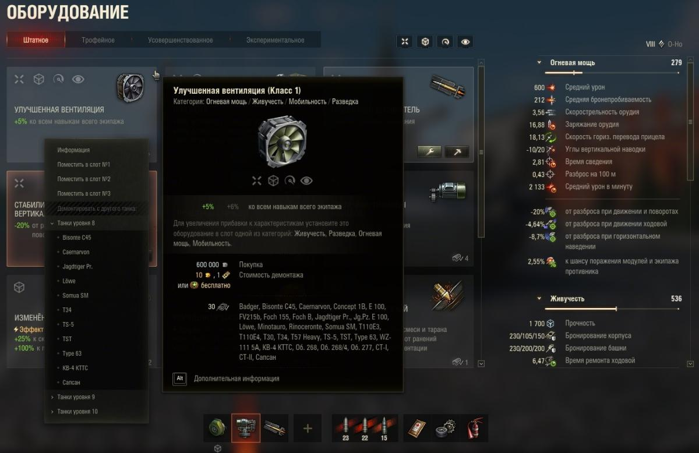

# Quick Demount - Быстрый демонтаж оборудования

Данный мод позволяет демонтировать оборудование через **контекстное меню** на карточке оборудования. 

В разделе "**Оборудование**" при нажатии правой кнопки мыши на карточке с оборудованием откроется контекстное меню. 

Если данное оборудование установлено хотя бы на одном танке, в контекстном меню появится дополнительный пункт "**Демонтировать с другого танка**", при нажатии на который появится список с танками. Выбираем танк, подтверждаем - оборудование демонтировано с него.

