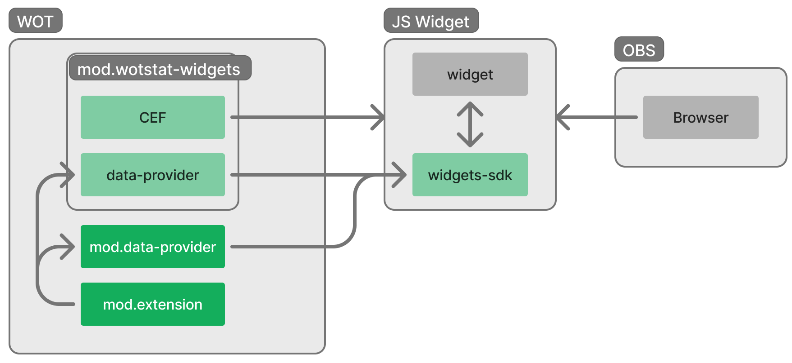

# Data Provider (для виджетов в OBS)

Легковесный мод который предоставляет локальным веб-виджетам доступ к событиям игры.

> Функционал этого мода уже встроен в [wotstat-widgets](https://github.com/WOT-STAT/wotstat-widgets), если вы планируете добавлять виджеты в игру, то не нужно дополнительно ничего устанавливать.

Данный мод полезен для стримеров, которые хотят встроить виджеты в OBS, но не хотят ставить *тяжелый* `wotstat-widgets`.

Этот мод никак не отображается в игре, не отправляет уведомлений и не добавляет никаких элементов интерфейса.
