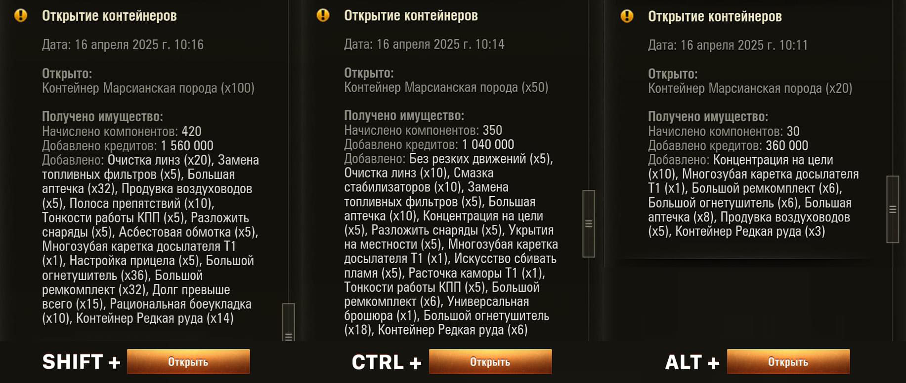

# Множественное открытие контейнеров
Мод позволяет открывать больше 10 контейнеров за раз.

## Использование
В интерфейсе открытия коробок, нажмите на кнопку `Открыть` с зажатой на клавиатуре клавишей `SHIFT`, `CTRL` или `ALT`:
- `SHIFT` + `ЛКМ` = открыть 100 контейнеров   
- `CTRL` + `ЛКМ` = открыть 50 контейнеров  
- `ALT` + `ЛКМ` = открыть 20 контейнеров  

> Максимально можно открывать 20 контейнеров в секунду. Поэтому, 100 контейнеров будут открываться 5 секунд (будет долго крутиться шестерёнка).